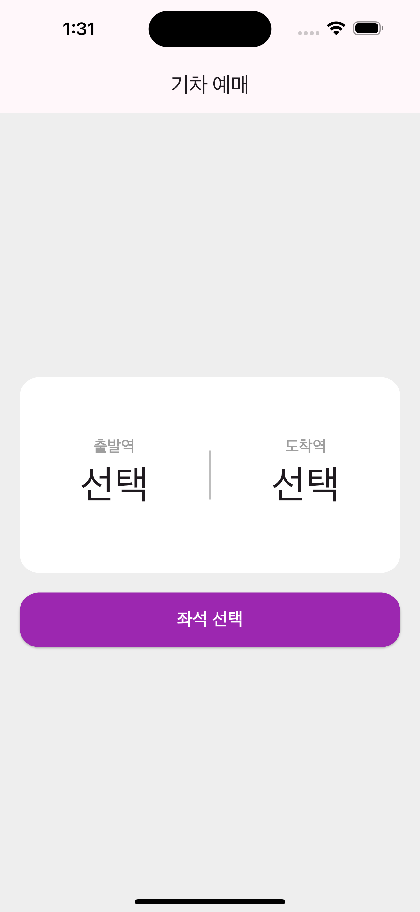
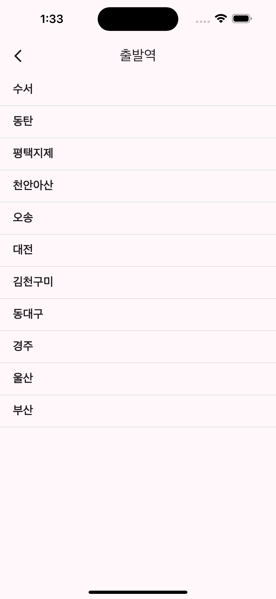
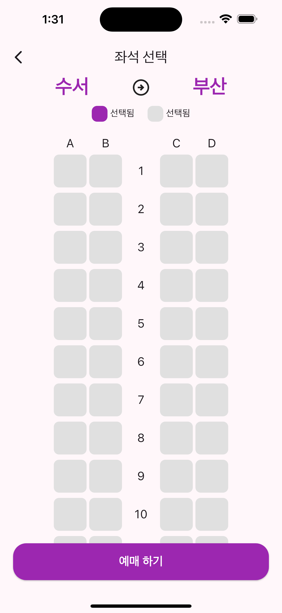

# Battle RPG GAME
개인 과제 - 기차 예매 서비스

## 프로젝트 소개
아래의 기능들이 있는 기차 예매 서비스 앱

 

| HomePage | StationListPage | SeatPage |
| --- | --- | --- |
|  |  |  |

 

< 필수 기능 > 
1. UI 명세서를 정확하게 반영
2. HomePage 구현
3. StationListPage 구현
4. SeatPage 구현

< 도전 기능 >
1. UX를 고려한 (같은 역 선택 불가) 기능
2. 다크 테마 적용
3. 자유 구현
    
## 적용 기능
#### < 필수 기능 >
>* UI 명세서를 정확하게 반영 : 
 UI 명세서에 적힌대로 레이아웃 작성  
>* HomePage 구현 : 
 출발역, 도착역을 선택할 수 있는 초기 화면 구현  
>* StationListPage 구현 : 
 기차역 리스트를 보여주고 선택할 수 있는 화면 구현  
>* SeatPage 구현 :
 좌석을 선택하는 화면 구현
#### < 도전 기능 >
>* UX를 고려한 (같은 역 선택 불가) 기능 :
 사용자가 역을 누르면 선택 페이지가 이를 인지하고, 이미 선택한 역을 제외한 목록을 보여주게 하는 기능  
>* 다크 테마 적용 :
 앱 전체에 적용되는 다크 테마를 적용하기
#### < 자유 구현 >
>* UX - 사용자가 테마 바꾸게 하기 : 
 사용자가 상호작용을 통해 테마를 light - dark 로 바꿀 수 있게 하는 기능  
>* HomePage의 출발역,도착역 스왑기능 :
 HomePage의 Swap아이콘버튼을 누르면, 출발역과 도착역이 바뀌게 되는 기능  
>* 예매한 좌석은 예매할 수 없도록 하는 기능 :
 한번 예매가 들어간 좌석은 다음 차례에 예매할 때, 더이상 예매가 안되도록 하는 기능.

## 🚨 Trouble Shooting

📚[ GetXController 종속성 관리 및 LifeCycle관련 이슈 ]

### [ TIL - GetXController ](https://hamiric.tistory.com/53)

  

✏️ [ GetX로 테마관리 하기 / GetX 사용 후기 ]

### [ TIL - GetX 사용 후기 ](https://hamiric.tistory.com/54)

  

💥 [ On Scroll Change AppBar Color Issue ]

### [ TIL - 스크롤시 앱바 색상 변경되는 이슈 ](https://hamiric.tistory.com/55)

  

## 📝Technologies & Tools (FE)

| 기술스택 | 배지 |
| --- | --- |
| Language |  |
| Framework |  |
| Code Editor |  |
| Library |  |
| Version Control |   |